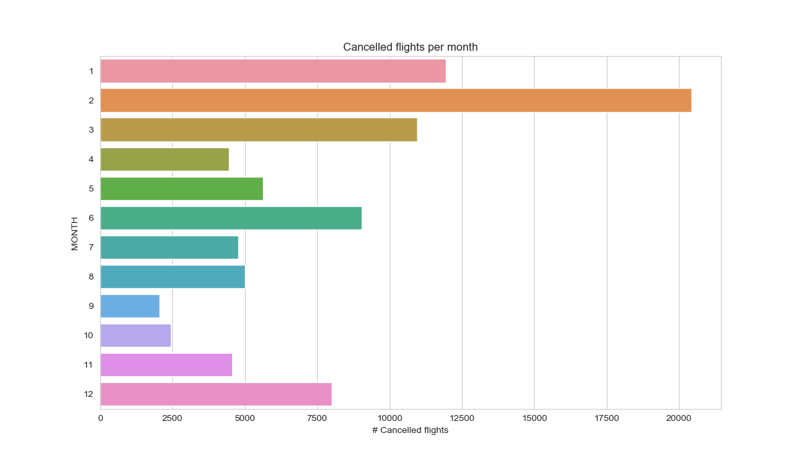
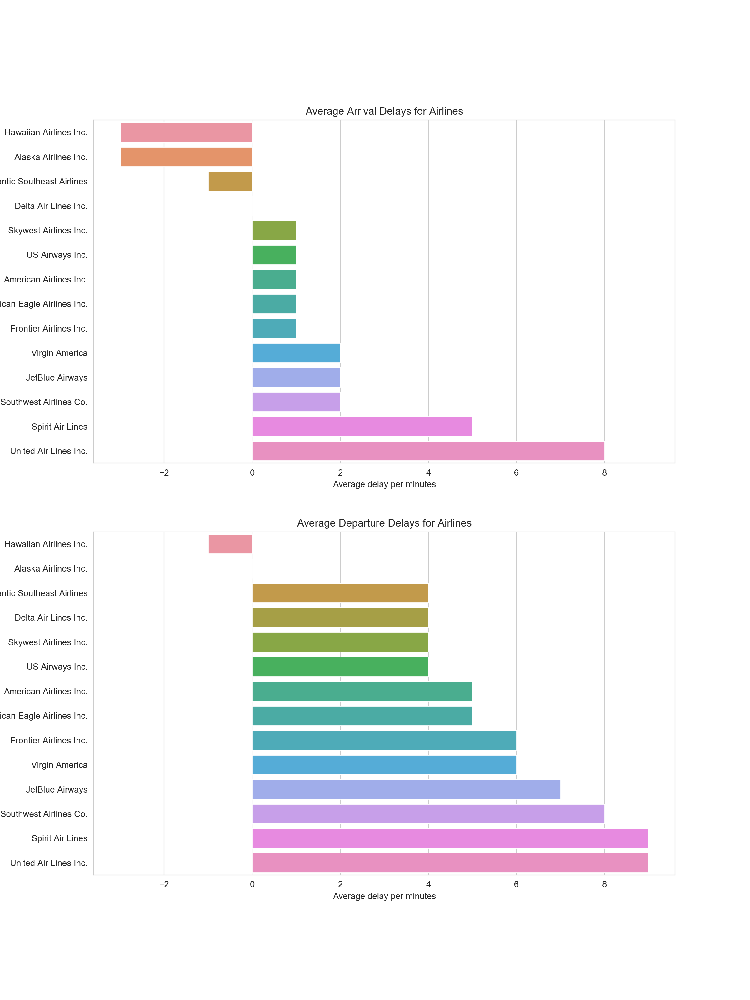
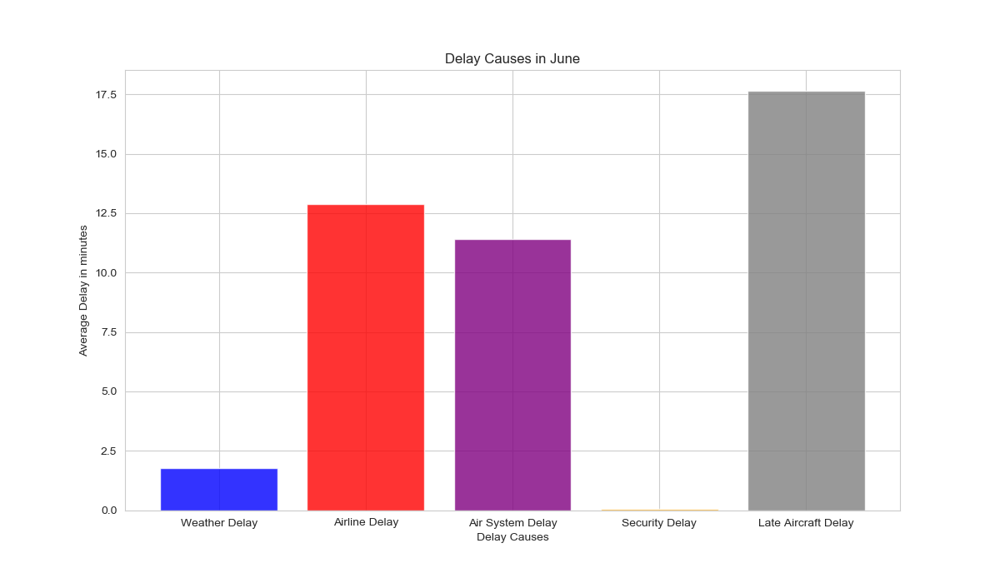
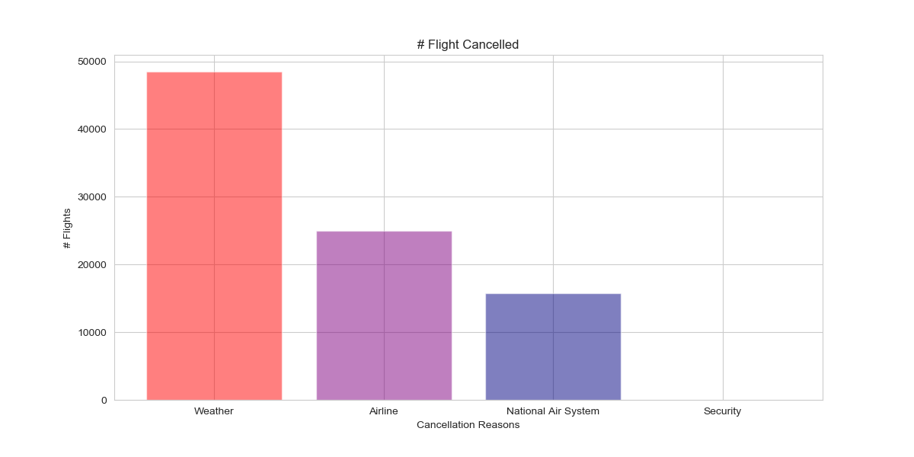

# Data Story:

## Observations

A review of the data demonstrates the following:
* June has the highest average of arrival and departure delays.

* February has the highest number of cancelled flights.

* United Airlines and Spirit Airlines have the highest ratio of delays in 2015.

## What are the possible factors that affected these results?

### Delays in June. WHY?
After analyzing and reviewing delay causes, **Late Aircraft** was the main cause of delays in june 2015, with an average delay of `17.6 minutes`. The summary is illustrated in the chart below.

### Cancellation and Delays in February. WHY?

### High Delay Ratio of United Airlines. WHY?
As illustrated in the bar chart below, the main delay causes of United Airlines are **Airline Delay** and **Late Aircraft**, with averages of `15 minutes` and `14.5 minutes`, respectively. In general, airline cancellations or delays are contollable which include  maintenance or crew issues, aircraft cleaning, baggage loading and fueling.

## How could we avoid these problems/take opportunities?

### For Aircrafts Delays:

### For Weather Delays and Cancellations:
* Understand whether certain airports are better equipped to deal with extreme weather conditions and replicate this model at other airports.
* Determine which time frames (i.e. morning, afternoon or evening flights) are the most at risk for delays and cancellations for the month of February.
* Optimize flight departure times based on ideal time frames.
* Price February ticket sales according to cancellation and delay likelihood.

### For Airline Delays:
* Understand whether the increase in June flight delays is due to higher flight traffic.
* Determine whether crew availability is adjusted based on higher flight traffic. 
