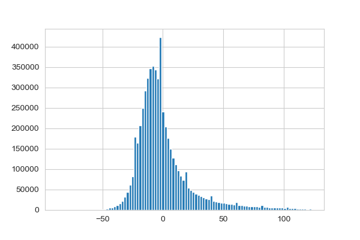
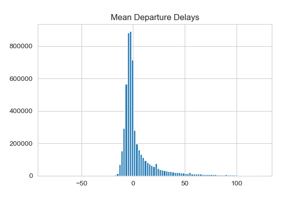
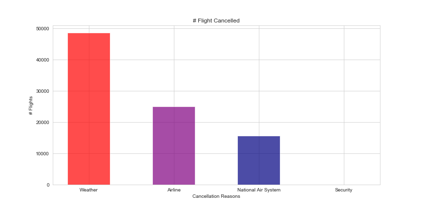
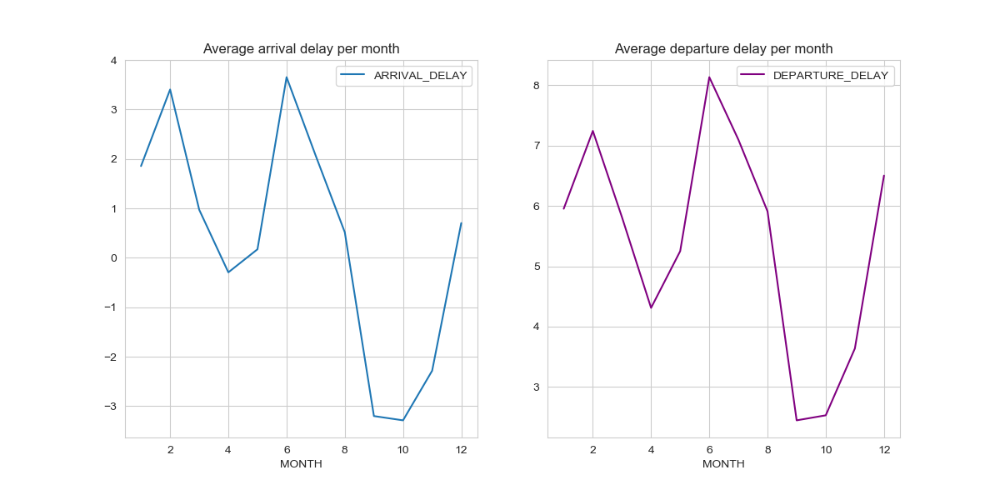
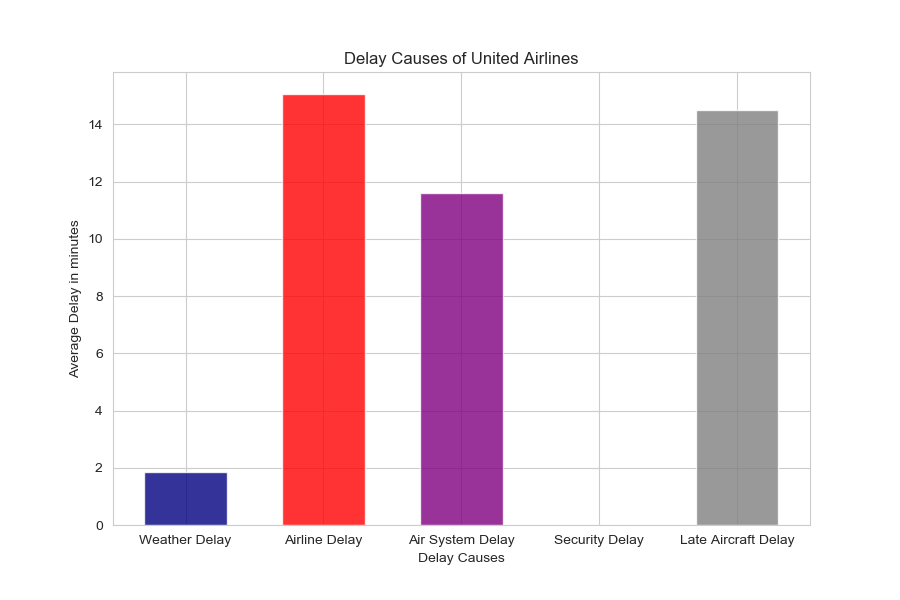

# Airlines Delay and Cancellation

## ABOUT THE DATASET
This 2015 dataset summarizes US airline flight delay and cancellation information as collected and published by the DOT's Bureau of Transportation Statistic. 

Drawing airport and airline information from two additional datasets helped expand the original source file by pulling from, and merging , relevant attributes. The dataset is now characterized by 28 representative features and includes over a million instances. Features include airport origin, time of the flight (YMD), actual and scheduled departure times, arrival times, flight number, as well as cancellation and delay reason.

## Attributes (28)
```
DATE, MONTH, FLIGHT_NUMBER, TAIL_NUMBER, ORIGIN_AC, DESTINATION_AC, ORIGIN_AIRPORT, DESTINATION_AIRPORT,
SCHEDULED_DEPARTURE, DEPARTURE_TIME, DEPARTURE_DELAY, SCHEDULED_TIME, ELAPSED_TIME, AIR_TIME, DISTANCE, 
CHEDULED_ARRIVAL, ARRIVAL_TIME, ARRIVAL_DELAY, DIVERTED, CANCELLED, CANCELLATION_REASON, AIR_SYSTEM_DELAY, 
ECURITY_DELAY, AIRLINE_DELAY, LATE_AIRCRAFT_DELAY, WEATHER_DELAY, AIRLINE_CODE, AIRLINE_NAME.
```

## Data Cleaning
To make the data more reliable, a cleaning phase was processed. This phase included: removing outliers, fill the missing values, rename the columns, remove the duplicated and unused columns, change types and finally merge the datasets.

## Data Visualization
To explore and understand the data, different charts were generated as well as some analysis, based on individual attributes or the correlation between multiple ones. We'll discuss and share some of them below.

* Individual Variables:
    * Arrival Delays
    
    * Departure Delays
    
    Conclusion: negative values means that some flights arrived / departed early than scheduled.
    * Cancellation Reasons
    
    Conclusion: Weather is the main reason of flights cancellation, causing `48538 flights` to be cancelled in 2015.

* Multiple Variables:
    * Months X Delays
    
    Conclusion: February has the highest average delays among all months. Mostly because of the weather extreme conditions.
    
    * Airlines X Delays
    
    Conslusion: United Airlines has the highest delay ratio. The chart below illustrates the possible factors causing the delay.
    

    * Airports X Delays
        * Flights *departing* from *Gustavus Airport* have the highest average delays.
        * Flights *arriving* to *St. Cloud Regional Airport* have the highest average delays.
        * Flights depart early from *Valdez Airport*, and also arrive early to it.

## Business Conclusions
* Understand whether certain airports are better equipped to deal with extreme weather conditions and replicate this model at other airports.
* Determine the ideal time frames (i.e. morning, afternoon or evening flights) for schedualing within the months in which we observed the highest number of flight cancellation and delays.
* Optimize flight departure times based on ideal time frames.
* Optimize flight ticket sales according to cancellation and delay likelihood.
* Understand whether the increase in June flight delays is due to higher flight traffic.
* Determine whether crew availability is adjusted based on higher flight traffic.
* Deterine whether the airlines with the highest ratio of delays is due to the higher volume of flights and similarily if the opposite shows to be true for airline with smaller flight network . 

## REFERENCES
* [Dataset Source](https://www.kaggle.com/usdot/flight-delays#airlines.csv).
* [Bureau of Transportation](https://www.bts.gov/topics/airlines-and-airports-0).
